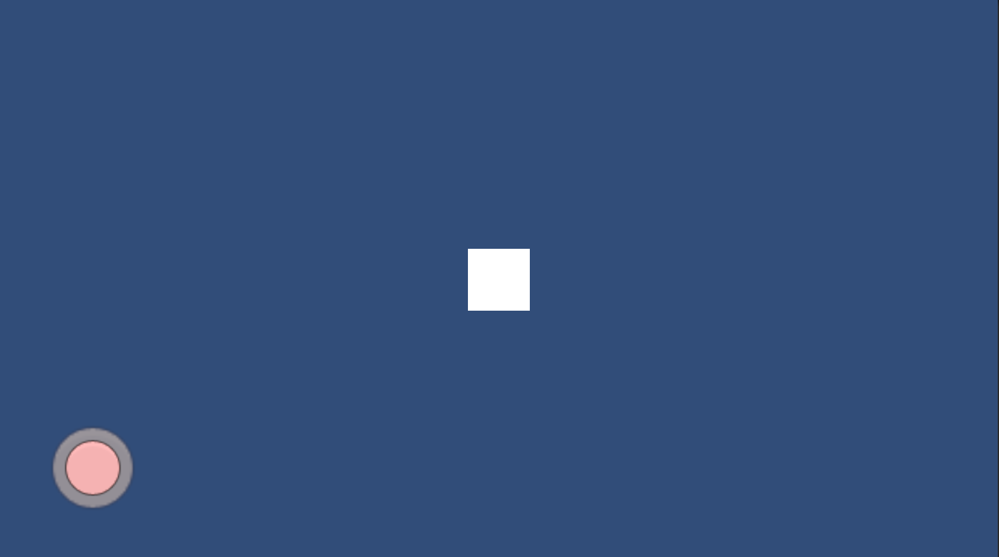

# Simple Virtual Joystick

Virtual Joystick 的层级结构如下。

```text
VirtualJoystick
|__Background
|__Pivot
   |__Joystick
```

Joystick 将自动获取父节点，也就是 Pivot 进行中心点定位，为了保证运行正确，不要修改 Pivot 节点的相关属性。

如果希望扩大 Joystick 的活动范围，可以修改 VirtualJoystick 节点下，VirtualJoystick 脚本的 Radius 值的大小。

